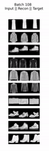
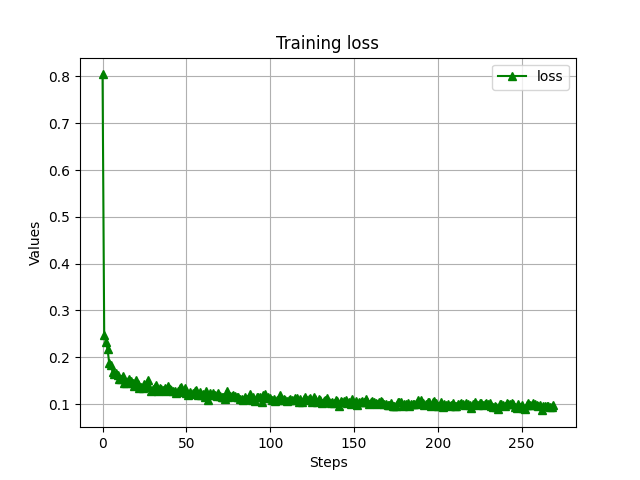
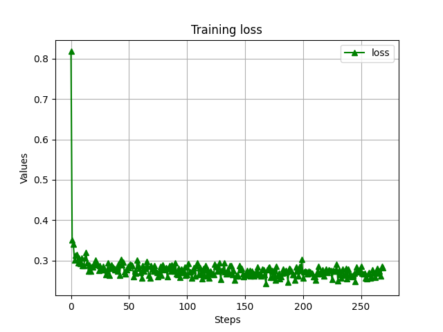
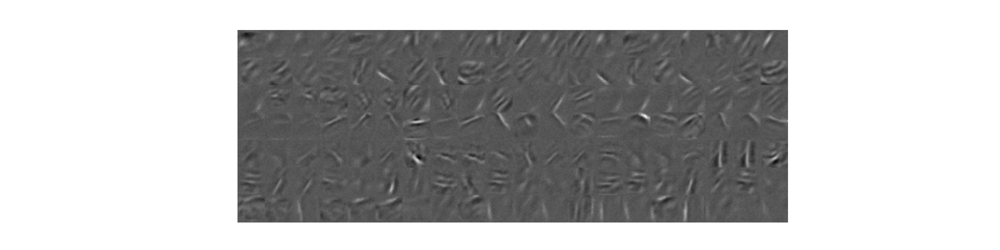

# ***Transforming Auto-Encoders***

Simple implementation of paper ***Transforming Auto-Encoders*** by G. E. Hinton, A. Krizhevsky and S. D. Wang.

Paper addr: http://www.cs.utoronto.ca/~hinton/absps/transauto6.pdf

## Backgrounds
In this paper, authors propose a novel architecture of network by first introducing Capsules. A capsule is 
a vector, which contains the probability that specifies whether the object being present or not and a 
set of “instantiation parameters” that may include the precise pose, lighting and deformation of the 
visual entity relative to an implicitly defined canonical version of that entity. Transforming Auto-Encoders
usses capsule idea to reconstruct shifted input image.


One can read paper carefully to understand how and why they design model like this.

## Requirements

```Python
pip install -r requirements.txt 
```

## Implementation

We simply run MNIST and Fashion MNIST with modified model(with RELU in the generation layer instead of Sigmoid).

### Hyper-parameters and defaults
```bash
--dataset = 'mnist' # 'mnist' or 'fashion_mnist'
--cap_dim = 120 # capsule dimension
--out_dim = 300 # output dimension
--num_caps = 7 # number of capsules
--epochs = 20 # number of epochs
--batch_size = 100 # number of batch size
```

### Train & Test

```python

python main.py main --dataset='mnist' --cap_dim=120 --out_dim=300 --num_caps=7 --epochs=20 --batch_size=32 --only_test=False

```

## Results
### MNIST


### Fashion MNIST



## Training statistics

### Loss
#### MNIST


#### Fashion MNIST


### Generation weights
#### MNIST


#### Fashion MNIST


***<center>Veni，vidi，vici --Caesar</center>***
